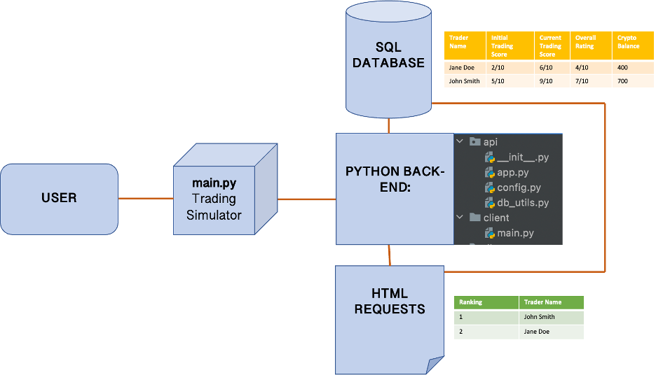

 # HOMEWORK WEEK2
 
 
This week’s homework will be purely Project based. You need to work as a group and the homework will be submitted by one of the members of your group. List the other members of your group in the document, so that your instructor can mark every student.
 
1. 	Your group needs to decide what kind of project you are going to work on and lock in your decision.
2. 	You need to submit a free style paper that describes your project on a high level. Please cover the following questions:
 
## 1. 	What are you building?

We are building an app that allows traders to be given a score based on their ability to trade and have good investor practice. To first obtain data on the traders a trading simulation will be completed on the app. The trading simulation will provide an initial trading score which will dictate how much preliminary digital currency they will be given to trade with on the platform. Investor conduct using the demo currency substantiates the internal trading score which is then reflected in how much demo currency is retained beyond the initial period. This model will reduce much of the subjective speculation which finds itself at the heart of trading nowadays. It therefore prevents bad actors from swaying the market in stating that they will make a trade despite lacking the funds. This will allow traders and enterprises alike to visualise other trader’s stats and to streamline the quality of trades made in the market.

To make this app we will first need to build an effective database to store all the information on the traders. We will then build an API that will connect the SQL database to the back-end logic of the trading app allowing a front – end user to access data from the database. The back-end logic will need to be created in Python. This logic will include simulating a trading simulator where an investor’s intended trades will be inputted overtime. This will be compared against the market's real-life performance. Using this data, we will use the python logic to make a back-end overall score and determine how much of the demo currency they keep. The logic will also allow a user to retrieve data from the database in the form of HTML requests for the trader and see their individual score.

## 2. 	What does it do or what kind of problem does it solve?
Technology developments lead to innovation in the financial industry and so accessing has become increasingly widespread. Depositing cheques no longer must be done in a high-street bank, sending money abroad no longer requires a trip to the credit union and trading shares is no longer exclusive to those standing in a stock exchange. Increased financial activity also incurs an increase in poor conduct which can be in the form of noisy trading, speculation, lack of information etc, and all deplete market efficiency and investor conduct. Regulatory measures are slow to be implemented despite the consequences of market inefficiency being prominent (e.g Robin Hood and Gamestop shares) and the dismay of other economic agents being evident (e.g Twitter vs Elon Musk). This program aims to filter out low-quality trades and enhance market efficiency and overall investor experience by incentivising ‘good’ investor conduct and raising communal responsibility. To summarize, our program will tackle the issue of anonymity in blockchain trading without enforcing AML or KYC measures. It is a compromise which allows traders to be held accountable for their trading tendencies/behavior without enforcing legal measures that often result in deterring people from trading platforms. 

## 3. 	What are the key features of your system?
Our system allows users to build their knowledge and confidence with cryptocurrency trading through the trading simulation. The quality of a user’s trade is evaluated and rated out of 10 and user’s are ranked based on their rating. Users can see ranking tables to allow them to know who is a credible trader. After a user earns a certain amount on our platform, they are able to withdraw money, including their winnings from the trading simulation. 

## 4. 	Provide a sample architecture diagram of your system (you can use PPT with squares and circles to demonstrate a simplified flow of your system) For example:

## 5. 	Describe the team approach to the project work: how are you planning to distribute the workload, how are you managing your code, how are you planning to test your system.

### DISTRIBUTING THE WORKLOAD

To distribute the workload, we will be using the Jira. This will enable each team member to plan, manage and report whatever task they’ve been assigned.
The way this will work is that a bigger picture of the project will be explained which is usually called ‘epic’. Then the epic will be broken down into smaller stories(user stories) in order for team members to get a summarized breakdown of what is to be done. User stories will then be broken down into tasks. Each team member will pick the task they can complete within the time frame given to deliver the application. 

This way, the team will be able to see who is working on a task, if they have completed it or not.

### MANAGING SOURCE CODE

For code management, we will use Git and Github.  Git will allow us to track file changes, resolve potential conflicts that may occur as a result of changes made by team members to the same file and lastly, it will allow team members to collaborate on the same set of files and see what changes have been made. 
Github will be used to store the files for the project.

### TEST THE SYSTEM

For testing, we will be using unittest. This will enable us to test the code for any possible bug that might cause the code to break and function improperly.